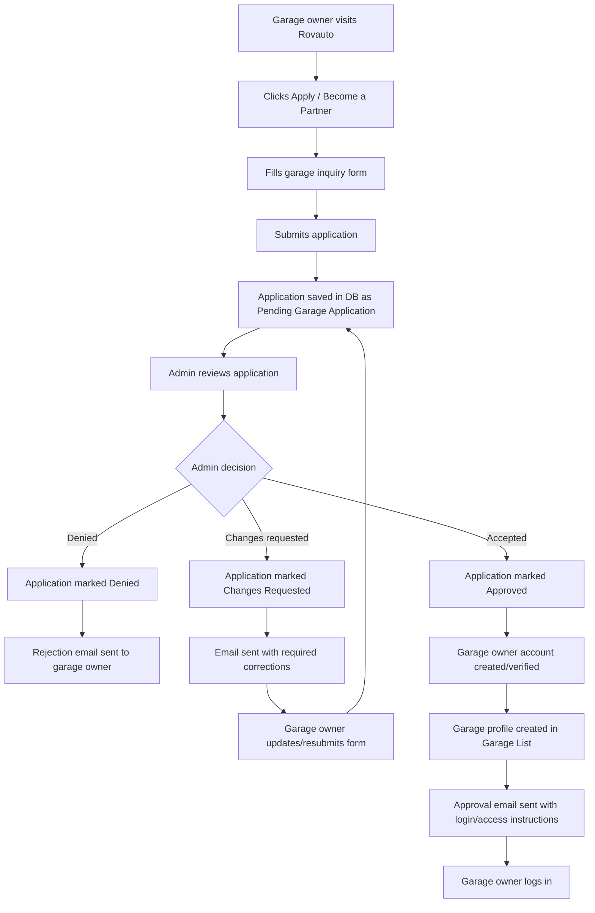
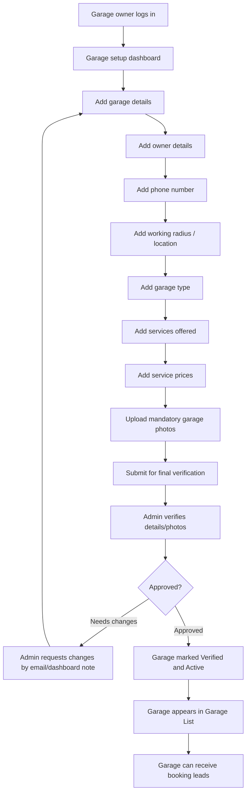
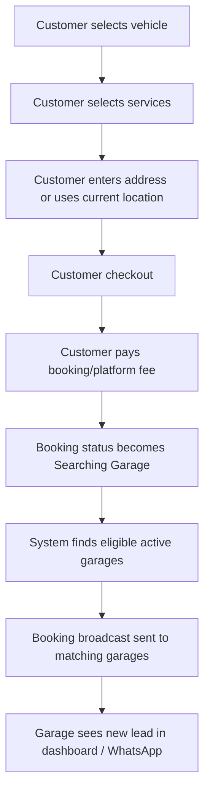
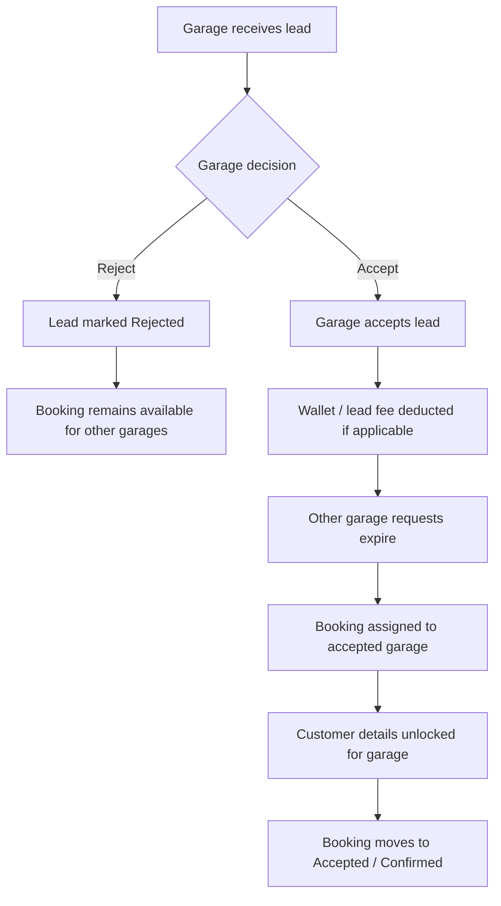
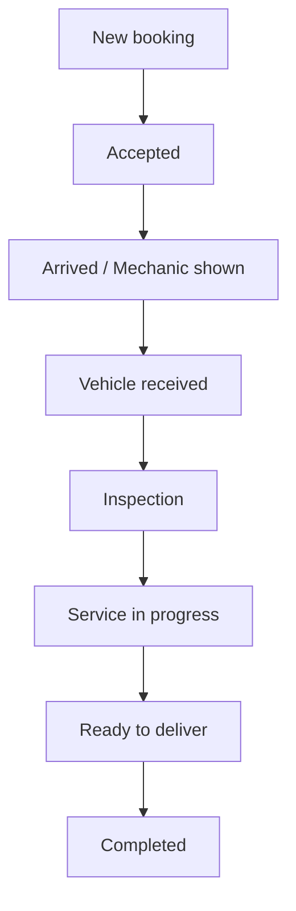
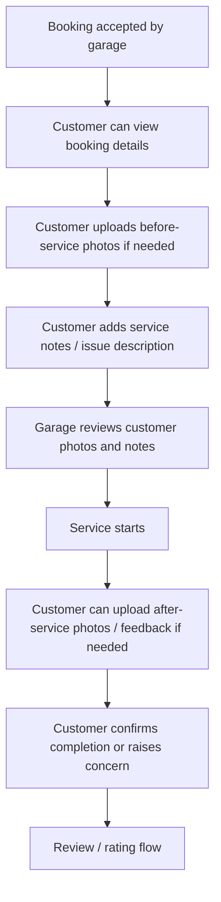
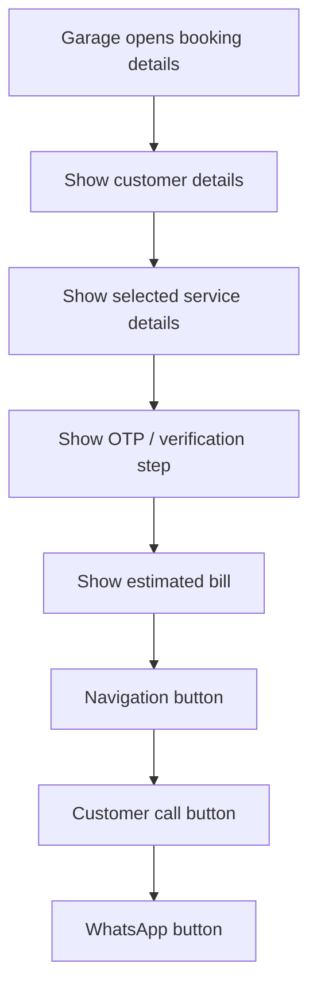
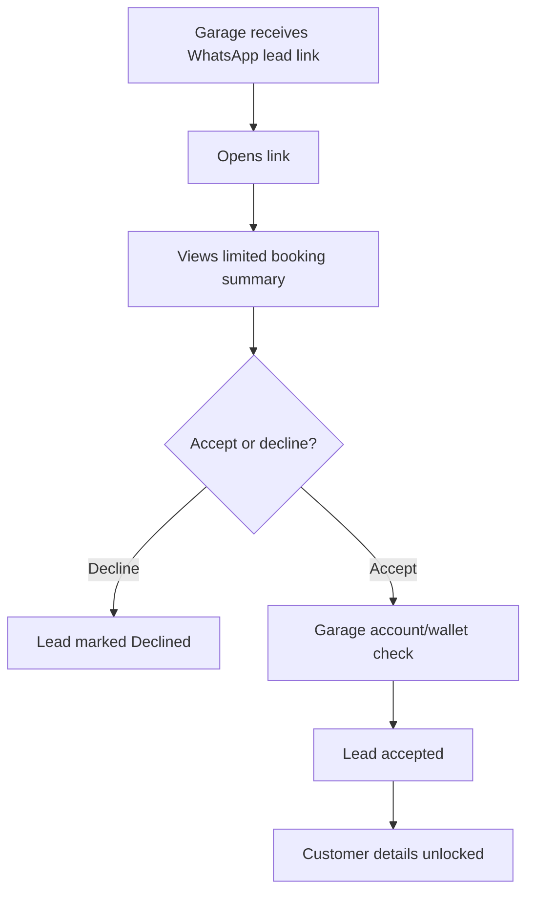
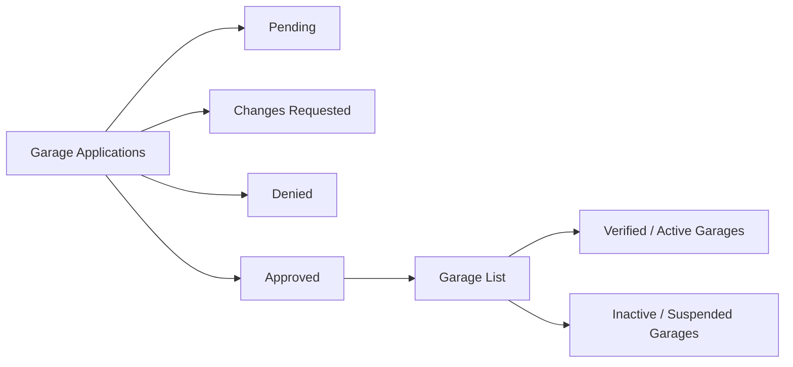

# Garage Partner And Booking Flow

## 1. Garage Partner Application Flow

## 2. Garage Setup And Listing Flow

## 3. Customer Booking To Garage Lead Flow

## 4. Garage Lead Accept / Reject Flow

## 5. Garage Job Status Flow

## 6. Customer Service Proof / Notes Flow

## 7. Booking Details Screen Flow

## 8. WhatsApp Lead Link Flow

## 9. Database Sections Needed

## Number-Wise Summary

1. Garage owner submits Apply to Become Partner inquiry form.
2. Form is saved in DB as Pending Garage Application.
3. Admin reviews pending applications.
4. Admin can approve, deny, or request changes.
5. Denied applications trigger rejection email.
6. Changes requested trigger correction email and allow resubmission.
7. Approved application creates/verifies garage owner account.
8. Approved garage profile moves into Garage List.
9. Garage owner logs in and completes setup.
10. Garage adds details, owner info, phone number, working radius, garage type, services, and prices.
11. Garage uploads mandatory garage photos.
12. Admin verifies setup details/photos.
13. Verified garage becomes active/listed.
14. Customer books service and pays booking/platform fee.
15. System broadcasts booking to eligible active garages.
16. Garage accepts or rejects lead.
17. If accepted, booking is assigned and customer details unlock.
18. Job moves through New, Accepted, Arrived, Vehicle Received, Inspection, Service in Progress, Ready to Deliver, Completed.
19. Customer handles before/after photos and service notes where needed.
20. Customer confirms completion and gives review/rating.
